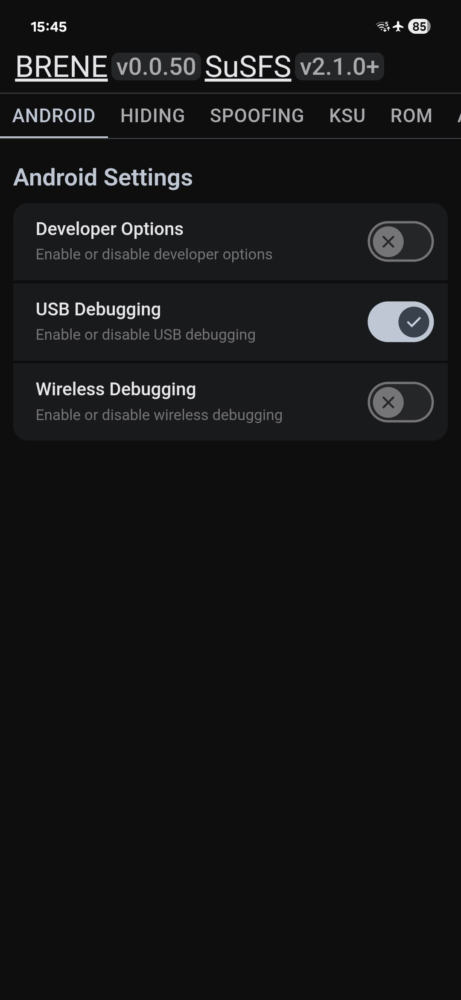
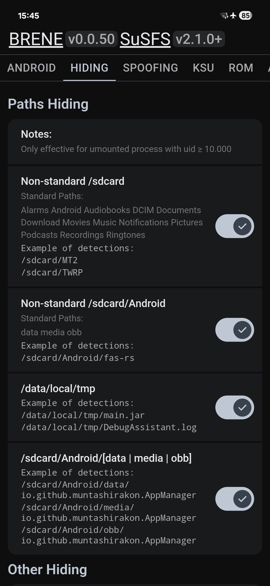
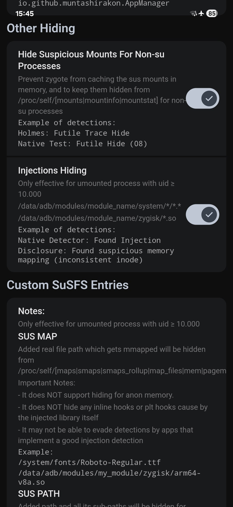
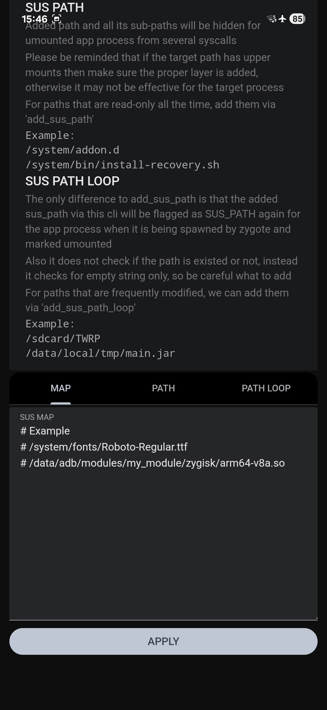
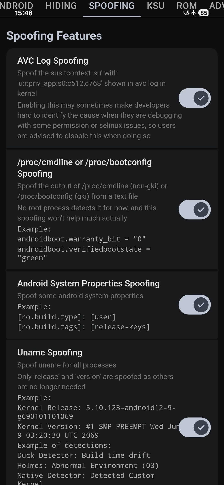
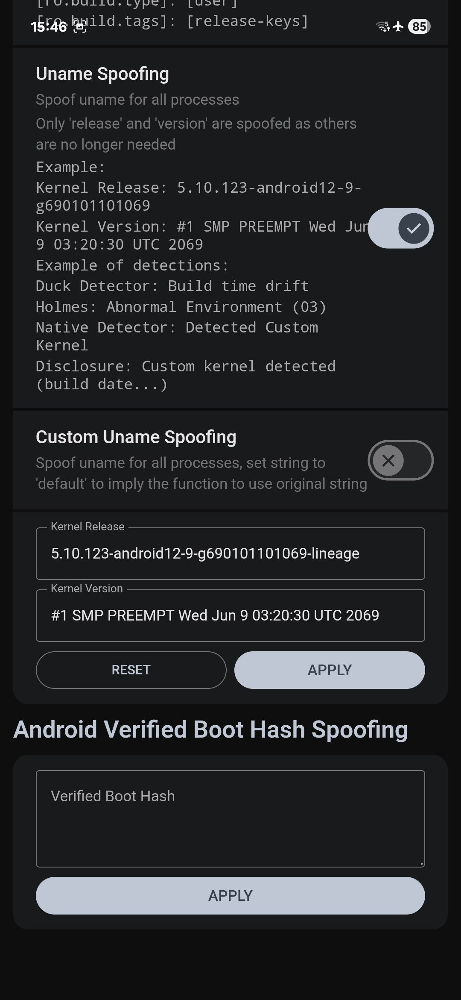
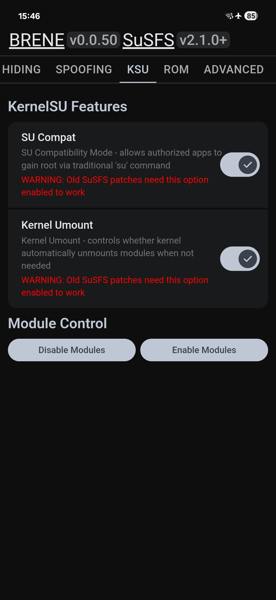
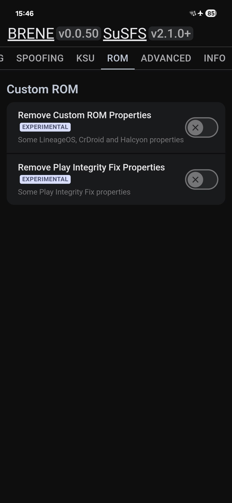
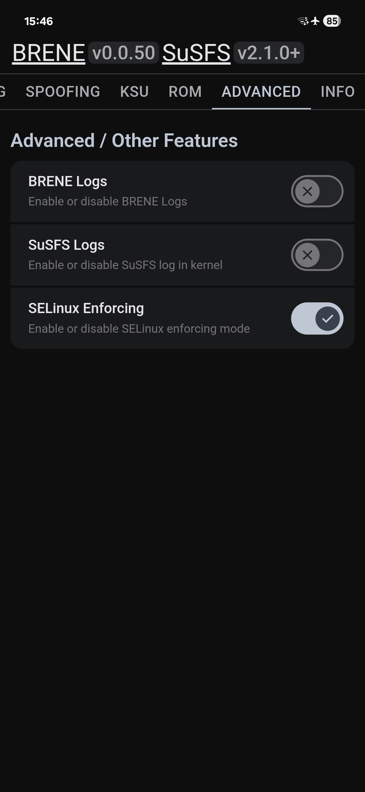
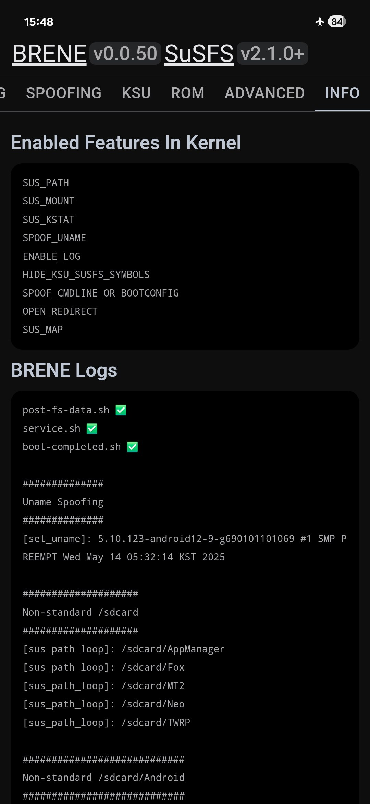

# BRENE - A SuSFS/KernelSU module for SuSFS patched kernels

This module is used for installing a userspace helper tool called ksu_susfs and susfs (They are the same binary) into /data/adb/ksu/bin/ to communicate with SUSFS kernel.

More information soon.

## Screenshots

<table>
  <tr>
    <td></td>
    <td></td>
    <td></td>
  <tr>
  <tr>
    <td></td>
    <td></td>
    <td></td>
  <tr>
  <tr>
    <td></td>
    <td></td>
    <td></td>
  <tr>
  <tr>
    <td></td>
  <tr>
</table>

## Supported Versions

- `susfs4ksu` v2.1.0+

## Hiding Features

- Hide All Items in `/data/local/tmp`
- Hide All Items in `/sdcard/Android/[data|media|obb]`
- Hide Folders of `Rooted Apps`
- Hide Folders of `Custom Recovery`
- Hide some traces caused by some `Custom Kernels`
- Hide some map traces caused by `Font Modules`
- Hide some map traces caused by `Zygisk Modules`
- Hide Suspicious Mounts For Non Su Processes

## Spoofing Features

- Spoof some `Android System Properties`
- Spoof the sus `'su'` tcontext shown in avc log

## Credits

- [`Magisk`](https://github.com/topjohnwu/Magisk)
- [`KernelSU`](https://github.com/tiann/KernelSU)
- [`susfs4ksu`](https://gitlab.com/simonpunk/susfs4ksu)
- [`KOWX712`](https://github.com/KOWX712)

## License

BRENE is licensed under [AGPL 3.0](./LICENSE). You can read more about it on [Open Source Initiative](https://opensource.org/licenses/AGPL-3.0).
